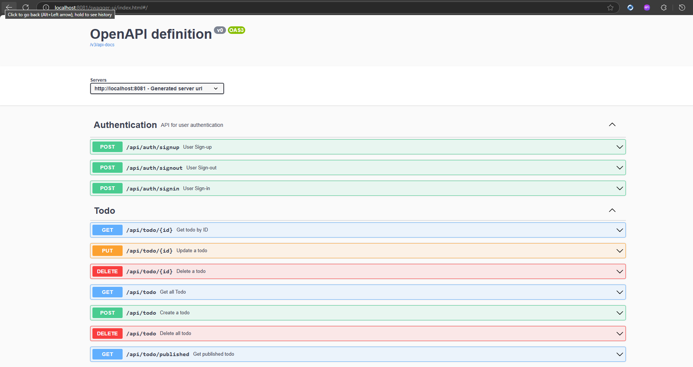
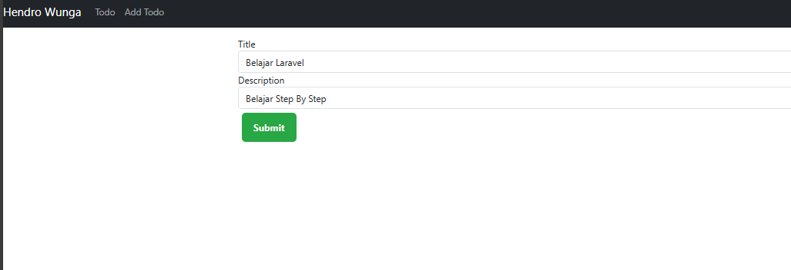
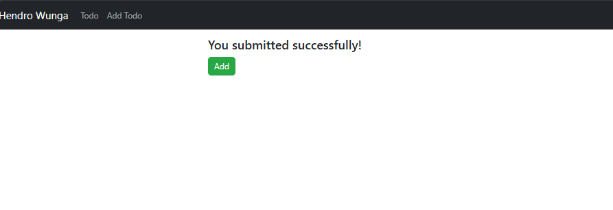
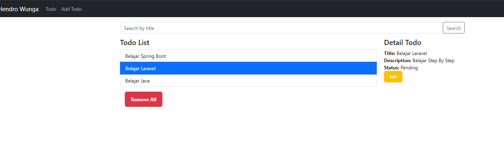
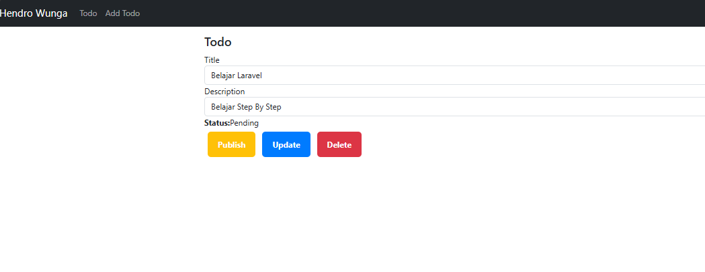

# Todo Application with User Management

Aplikasi Todo adalah platform sederhana yang memungkinkan pengguna untuk mengelola tugas-tugas mereka dengan mudah, sekaligus mengelola akun pengguna. Pengguna dapat mendaftar, masuk, dan mengelola tugas-tugas mereka dengan antarmuka.

## Fitur

### Pengelolaan Pengguna
- **Registrasi Pengguna**: Pengguna baru dapat mendaftar untuk membuat akun.
- **Login dan Logout**: Pengguna dapat masuk ke akun mereka dan keluar dengan mudah.
- **Peran dan Akses**: Pengelolaan peran pengguna, memungkinkan admin untuk mengelola hak akses.

### Manajemen Tugas
- **CRUD Todo**: Pengguna dapat membuat, membaca, memperbarui, dan menghapus tugas.
- **Filter Todo**: Pengguna dapat menyaring tugas berdasarkan status (semua, selesai, atau belum selesai).

## Alat yang Digunakan

### Backend
- **Spring Boot**
- **Spring Data JPA**
- **H2 Database**
- **Spring Security**
- **Swagger**

#### application.yml:
    ```
        spring:
            datasource:
                url: jdbc:mysql://localhost:3306/todoapp
                username: // database username
                password: // database password
                driver-class-name: com.mysql.cj.jdbc.Driver  

            jpa:
                hibernate:
                    ddl-auto: update  
                show-sql: true       
                properties:
                    hibernate:
                        format_sql: true  
                    open-in-view: false   

        springdoc:
            api-docs:
                path: /v3/api-docs
            swagger-ui:
                path: /swagger-ui.html

        server:
            port: 8081

        ```
#### Endpoint


### Frontend
- **React**: Library JavaScript untuk membangun antarmuka pengguna yang interaktif.
- **Axios**: Untuk melakukan permintaan HTTP ke backend.
- **React Router**: Untuk navigasi antar halaman dalam aplikasi.
- **Bootstrap**: Untuk styling dan responsivitas antarmuka pengguna.

#### Add Todo




#### Todo List





## Instalasi

**Clone the repository**:
   ```bash
   git clone https://github.com/hendrowunga/Todo-Spring-React.git
   cd todo-app
